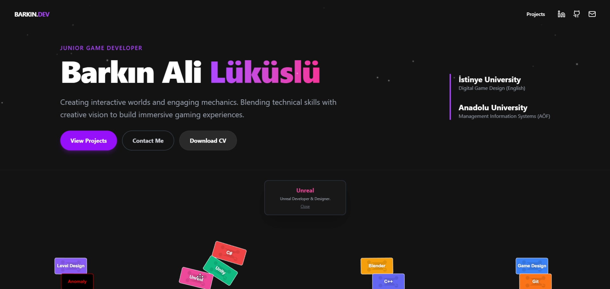
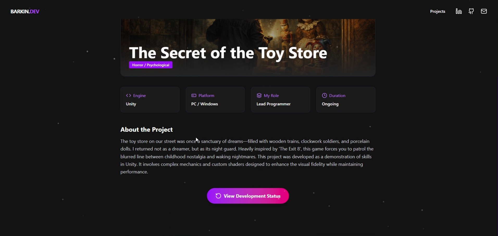

# Barkın Ali Lüküslü - Portfolio

Welcome to my personal portfolio website! This project is built using React and Vite, showcasing my frontend development skills, projects, and professional background.

## 🚀 Technologies Used
- **React**: Frontend UI framework
- **Vite**: Next-generation frontend tooling and bundler
- **Tailwind CSS**: Utility-first CSS framework for rapid UI development
- **Framer Motion**: Production-ready animation library for React
- **Matter.js**: 2D physics engine for interactive elements
- **Lucide React**: Beautiful and consistent iconography

## 📸 Screenshots

Here are some visual previews of the portfolio. *(Please ensure these image files are placed in `public/assets/images/` with matching filenames)*:

| Home / Hero | My Projects |
| :---: | :---: |
|  |  |

| Project Details | Development Timeline |
| :---: | :---: |
|  |  |

<p align="center">
  <b>Loading Screen</b><br>
  
</p>

## 📦 Project Structure

```
├── public/              # Static assets (images, fonts, sounds, CV)
├── src/                 # Source code
│   ├── assets/          # Static assets loaded through JS
│   ├── components/      # Reusable React components (Navbar, Footer, UI elements)
│   ├── context/         # React Context providers for global state management
│   ├── data/            # Local JSON/JS data files (mock data, content for site)
│   ├── pages/           # Main page components (Home, Projects, etc.)
│   ├── App.jsx          # Root component
│   └── main.jsx         # Entry point
└── package.json         # Project metadata and dependencies
```

## 🛠️ Getting Started

### Prerequisites

Make sure you have Node.js and npm installed on your machine.

### Installation

1. Clone the repository
2. Install the dependencies:
   ```bash
   npm install
   ```
3. Run the development server:
   ```bash
   npm run dev
   ```

### Building for Production

To create a production build of the project, run:

```bash
npm run build
```

This will generate a `dist` folder populated with the optimized files ready for deployment.

## 📄 License
This project is for personal use as a portfolio.
