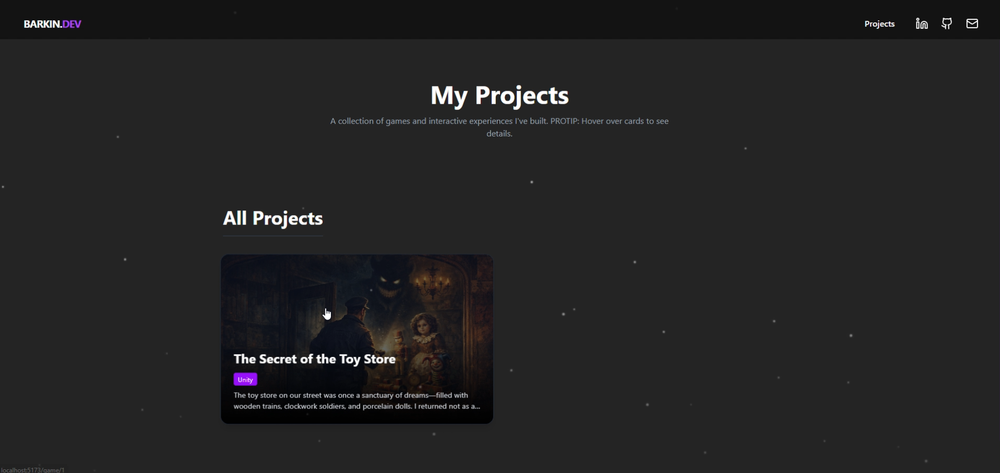
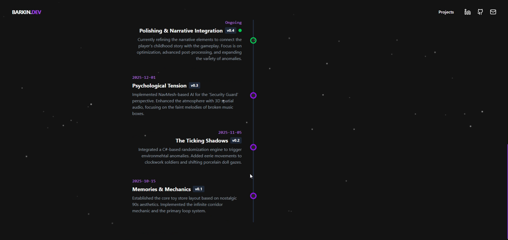

# Barkın Ali Lüküslü - Portfolio

Welcome to the portfolio website of Barkın Ali Lüküslü! This project was built using React and Vite to showcase Barkın's game development skills, projects, and professional background.

## 🚀 Technologies Used
- **React**: Frontend UI framework
- **Vite**: Next-generation frontend tooling and bundler
- **Tailwind CSS**: Utility-first CSS framework for rapid UI development
- **Framer Motion**: Production-ready animation library for React
- **Matter.js**: 2D physics engine for interactive elements
- **Lucide React**: Beautiful and consistent iconography

## 📸 Screenshots

Here are some visual previews of the portfolio:

| Home / Hero | My Projects |
| :---: | :---: |
|  |  |

| Project Details | Development Timeline |
| :---: | :---: |
|  |  |

<p align="center">
  <b>Loading Screen</b><br>
  
</p>

## 📦 Project Structure

```
├── frontend/            # React/Vite Application codebase
│   ├── public/          # Static assets (images, fonts, sounds, CV)
│   ├── src/             # Source code
│   │   ├── ...          # (components, pages, context, data, etc.)
│   │   └── main.jsx     # Entry point
│   └── package.json     # Frontend dependencies
```

## 🛠️ Getting Started

### Prerequisites

Make sure you have Node.js and npm installed on your machine.

### Installation

1. Clone the repository
2. Install the dependencies:
   ```bash
   cd frontend
   npm install
   ```
3. Run the development server:
   ```bash
   npm run dev
   ```

### Building for Production

To create a production build of the project, run:

```bash
cd frontend
npm run build
```

This will generate a `dist` folder populated with the optimized files ready for deployment.

## 📄 License
This project is for use as Barkın Ali Lüküslü's personal portfolio.
